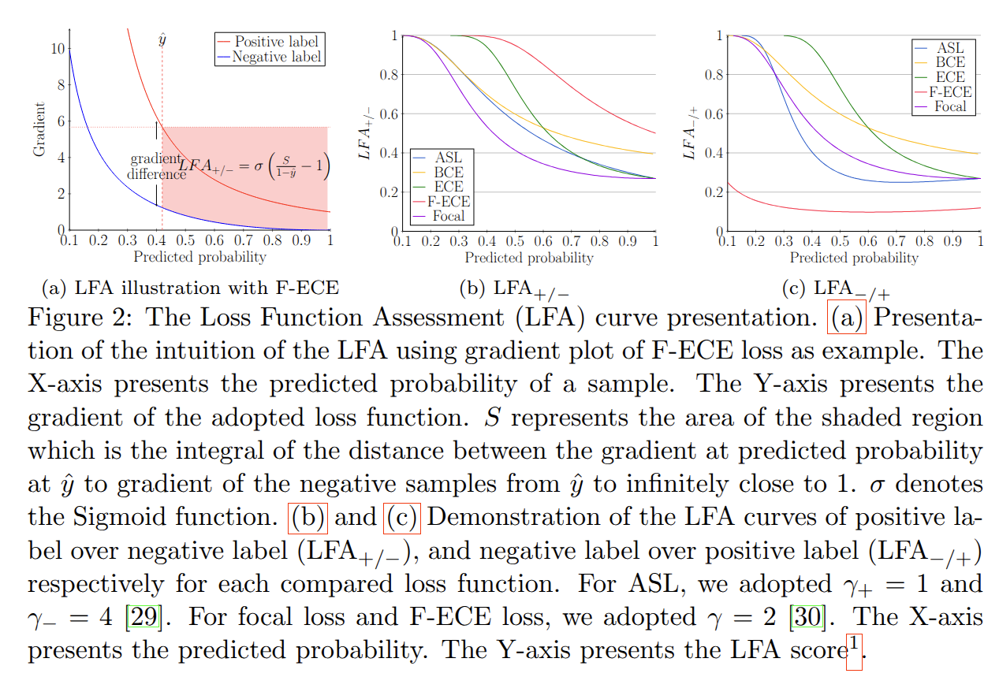

# LFA-CIFAR10: Loss Function Assessment (LFA) and F‑ECE on CIFAR‑10

## Overview


This repository provides an example of reproducible implementation of the **Loss Function Assessment (LFA)** framework and the **Focal‑balanced Exponential Cross‑Entropy (F‑ECE)** loss on **CIFAR‑10**. 
The goal is to analyze hard‑to‑learn classes and to evaluate how probability‑defined losses (BCE, Focal Loss, ASL, F‑ECE) shape gradient–probability behavior and recall on difficult categories.

## Repository Structure

```


LFA-CIFAR10/
├── datasets/          # CIFAR-10 loading & transforms
├── models/            # CNN/backbone definitions
├── losses/            # BCE, Focal, ASL, F‑ECE
├── utils/             # metrics (recall, miss, overflow), helpers
├── train.py           # training entrypoint
├── evaluate.py        # evaluation entrypoint
├── results/           # experiment artifacts (kept) — logs removed
├── assets/            # figures & diagrams (auto-imported if available)
├── requirements.txt
└── LICENSE

```

## Installation

```bash
python -m venv .venv && source .venv/bin/activate
pip install -r requirements.txt
```

## Quick Start

```bash
# Training (example)
python train.py --dataset cifar10 --epochs 200 --batch-size 128 --loss F-ECE --lr 0.1

# Evaluation
python evaluate.py --dataset cifar10 --checkpoint path/to/weights.pth
```

## Figure 2 (LFA Visualization)

> **Figure 2** could not be auto-located in the provided archives. Please replace `assets/figure2.png` with the correct image if available.




## Datasets

*attributes of datasets included in the Original paper of LFA *
#### **Medical Datasets**

##### **Breast Histopathology**

| Condition | Quantity | Subset Condition | Quantity |
|:--|:--:|:--:|:--:|
| IDC+ | 78,786 | IDC+ (subset) | 11,050 |
| IDC- | 198,738 | IDC- (subset) | 44,200 |
| **Total** | **277,524** | **Total** | **55,259** |

##### **CADCAP**

| Condition | Quantity |
|:--|:--:|
| Inflammatory | 607 |
| Vascular Lesions | 605 |
| Healthy Control | 600 |
| **Total** | **1,812** |


#### **General Datasets*

##### **CelebA**

| Label | Quantity | Label | Quantity | Label | Quantity |
|:--|:--:|:--:|:--:|:--:|:--:|
| 5 o Clock Shadow | 22,516 | Arched Eyebrows | 54,090 | Attractive | 103,833 |
| Bags Under Eyes | 41,446 | Bald | 4,547 | Bangs | 30,709 |
| Big Lips | 48,785 | Big Nose | 47,516 | Black Hair | 48,472 |
| Blond Hair | 29,983 | Blurry | 10,312 | Brown Hair | 41,572 |
| Bushy Eyebrows | 28,803 | Chubby | 11,663 | Double Chin | 9,459 |
| Eyeglasses | 13,193 | Goatee | 12,716 | Gray Hair | 8,499 |
| Heavy Makeup | 78,390 | High Cheekbones | 92,189 | Male | 84,434 |
| Mouth Slightly Open | 97,942 | Mustache | 8,417 | Narrow Eyes | 23,329 |
| No Beard | 169,158 | Oval Face | 57,567 | Pale Skin | 8,701 |
| Pointy Nose | 56,210 | Receding Hairline | 16,163 | Rosy Cheeks | 13,315 |
| Sideburns | 11,449 | Smiling | 97,669 | Straight Hair | 42,222 |
| Wavy Hair | 64,744 | Wearing Earrings | 38,276 | Wearing Hat | 9,818 |
| Wearing Lipstick | 95,715 | Wearing Necklace | 24,913 | Wearing Necktie | 14,732 |
| Young | 156,734 |  |  |  |  |
| **Total** | **202,599** |  |  |  |  |

##### **CIFAR10_LT**

| Label | Quantity | Label | Quantity | Label | Quantity |
|:--|:--:|:--:|:--:|:--:|:--:|
| Airplane | 5,000 | Automobile | 3,422 | Bird | 3,650 |
| Cat | 3,885 | Deer | 3,020 | Dog | 228 |
| Frog | 2,525 | Horse | 4,308 | Ship | 2,259 |
| Truck | 4,934 |  |  |  |  |
| **Total** | **70,000** |  |  |  |  |

#### **ImageNet_LT**

| Label | Quantity | Label | Quantity | Label | Quantity | Label | Quantity | Label | Quantity |
|:--:|:--:|:--:|:--:|:--:|:--:|:--:|:--:|:--:|:--:|
| 0 | 50 | 1 | 87 | 2 | 124 | 3 | 161 | 4 | 198 |
| 5 | 235 | 6 | 272 | 7 | 309 | 8 | 346 | 9 | 383 |
| 10 | 420 | 11 | 457 | 12 | 494 | 13 | 531 | 14 | 568 |
| 15 | 605 | 16 | 642 | 17 | 679 | 18 | 716 | 19 | 753 |
| 20 | 790 | 21 | 827 | 22 | 864 | 23 | 901 | 24 | 938 |
| 25 | 975 | 26 | 1012 | 27 | 1049 | 28 | 1086 | 29 | 1123 |
| 30 | 1160 | 31 | 1197 | 32 | 1234 | 33 | 1271 | 34 | 1308 |
| 35 | 1345 | 36 | 1382 | 37 | 1419 | 38 | 1456 | 39 | 1493 |
| 40 | 1530 | 41 | 67 | 42 | 104 | 43 | 141 | 44 | 178 |
| 45 | 215 | 46 | 252 | 47 | 289 | 48 | 326 | 49 | 363 |
| ⋮ | ⋮ | ⋮ | ⋮ | ⋮ | ⋮ | ⋮ | ⋮ | ⋮ | ⋮ |
| *(Rows 50–999 omitted for brevity — full table available in `data/ImageNet_LT_full.csv`)* |

> **Note:**  
> The full 1000-class ImageNet_LT distribution is included in the repository as a CSV file for readability:
> ```
> data/ImageNet_LT_full.csv
> ```
> Only the first few rows are shown above for demonstration.
>

### **CIFAR-10 Class-wise Performance (ResNet-50)**

| Loss | Class | AUC | Threshold | Acc | Precision | Recall | F0.5 | F0 | F1 |
|:--|:--:|:--:|:--:|:--:|:--:|:--:|:--:|:--:|:--:|
| **ASL** | 1 | 0.87±0.01 | 0.55±0.03 | 0.86±0.01 | 0.87±0.00 | 0.86±0.01 | 0.86±0.00 | 0.87±0.00 | 0.86±0.01 |
|  | 2 | 0.87±0.01 | 0.52±0.03 | 0.87±0.01 | 0.89±0.00 | 0.87±0.01 | 0.89±0.00 | 0.89±0.00 | 0.88±0.01 |
|  | 3 | 0.77±0.01 | 0.48±0.01 | 0.83±0.01 | 0.89±0.01 | 0.83±0.01 | 0.87±0.00 | 0.89±0.01 | 0.85±0.01 |
|  | 4 | 0.82±0.01 | 0.52±0.01 | 0.82±0.01 | 0.87±0.00 | 0.82±0.01 | 0.85±0.00 | 0.87±0.00 | 0.84±0.01 |
|  | 5 | 0.81±0.02 | 0.52±0.02 | 0.85±0.02 | 0.89±0.00 | 0.85±0.02 | 0.88±0.01 | 0.89±0.00 | 0.86±0.01 |
|  | 6 | 0.75±0.01 | 0.42±0.03 | 0.99±0.00 | 0.99±0.00 | 0.99±0.00 | 0.99±0.00 | 0.99±0.00 | 0.99±0.00 |
|  | 7 | 0.88±0.01 | 0.53±0.02 | 0.90±0.00 | 0.92±0.00 | 0.90±0.00 | 0.91±0.00 | 0.92±0.00 | 0.91±0.00 |
|  | 8 | 0.82±0.00 | 0.52±0.03 | 0.82±0.00 | 0.86±0.00 | 0.82±0.00 | 0.85±0.00 | 0.86±0.00 | 0.83±0.00 |
|  | 9 | 0.85±0.01 | 0.49±0.03 | 0.88±0.01 | 0.91±0.00 | 0.88±0.01 | 0.91±0.00 | 0.91±0.00 | 0.90±0.01 |
|  | 10 | 0.86±0.01 | 0.53±0.04 | 0.82±0.02 | 0.86±0.01 | 0.82±0.02 | 0.85±0.00 | 0.86±0.01 | 0.83±0.01 |
| **BCE** | 1 | 0.87±0.01 | 0.55±0.03 | 0.86±0.01 | 0.87±0.00 | 0.86±0.01 | 0.86±0.00 | 0.87±0.00 | 0.86±0.01 |
|  | 2 | 0.87±0.01 | 0.52±0.03 | 0.87±0.01 | 0.89±0.00 | 0.87±0.01 | 0.89±0.00 | 0.89±0.00 | 0.88±0.01 |
|  | 3 | 0.77±0.01 | 0.48±0.01 | 0.83±0.01 | 0.89±0.01 | 0.83±0.01 | 0.87±0.00 | 0.89±0.01 | 0.85±0.01 |
|  | 4 | 0.82±0.01 | 0.52±0.01 | 0.82±0.01 | 0.87±0.00 | 0.82±0.01 | 0.85±0.00 | 0.87±0.00 | 0.84±0.01 |
|  | 5 | 0.81±0.02 | 0.52±0.02 | 0.85±0.02 | 0.89±0.00 | 0.85±0.02 | 0.88±0.01 | 0.89±0.00 | 0.86±0.01 |
|  | 6 | 0.75±0.01 | 0.42±0.03 | 0.99±0.00 | 0.99±0.00 | 0.99±0.00 | 0.99±0.00 | 0.99±0.00 | 0.99±0.00 |
|  | 7 | 0.88±0.01 | 0.53±0.02 | 0.90±0.00 | 0.92±0.00 | 0.90±0.00 | 0.91±0.00 | 0.92±0.00 | 0.91±0.00 |
|  | 8 | 0.82±0.00 | 0.52±0.03 | 0.82±0.00 | 0.86±0.00 | 0.82±0.00 | 0.85±0.00 | 0.86±0.00 | 0.83±0.00 |
|  | 9 | 0.85±0.01 | 0.49±0.03 | 0.88±0.01 | 0.91±0.00 | 0.88±0.01 | 0.91±0.00 | 0.91±0.00 | 0.90±0.01 |
|  | 10 | 0.86±0.01 | 0.53±0.04 | 0.82±0.02 | 0.86±0.01 | 0.82±0.02 | 0.85±0.00 | 0.86±0.01 | 0.83±0.01 |
| **ECE** | 1 | 0.87±0.01 | 0.55±0.03 | 0.86±0.01 | 0.87±0.00 | 0.86±0.01 | 0.86±0.00 | 0.87±0.00 | 0.86±0.01 |
|  | 2 | 0.87±0.01 | 0.52±0.03 | 0.87±0.01 | 0.89±0.00 | 0.87±0.01 | 0.89±0.00 | 0.89±0.00 | 0.88±0.01 |
|  | 3 | 0.77±0.01 | 0.48±0.01 | 0.83±0.01 | 0.89±0.01 | 0.83±0.01 | 0.87±0.00 | 0.89±0.01 | 0.85±0.01 |
|  | 4 | 0.82±0.01 | 0.52±0.01 | 0.82±0.01 | 0.87±0.00 | 0.82±0.01 | 0.85±0.00 | 0.87±0.00 | 0.84±0.01 |
|  | 5 | 0.81±0.02 | 0.52±0.02 | 0.85±0.02 | 0.89±0.00 | 0.85±0.02 | 0.88±0.01 | 0.89±0.00 | 0.86±0.01 |
|  | 6 | 0.75±0.01 | 0.42±0.03 | 0.99±0.00 | 0.99±0.00 | 0.99±0.00 | 0.99±0.00 | 0.99±0.00 | 0.99±0.00 |
|  | 7 | 0.88±0.01 | 0.53±0.02 | 0.90±0.00 | 0.92±0.00 | 0.90±0.00 | 0.91±0.00 | 0.92±0.00 | 0.91±0.00 |
|  | 8 | 0.82±0.00 | 0.52±0.03 | 0.82±0.00 | 0.86±0.00 | 0.82±0.00 | 0.85±0.00 | 0.86±0.00 | 0.83±0.00 |
|  | 9 | 0.85±0.01 | 0.49±0.03 | 0.88±0.01 | 0.91±0.00 | 0.88±0.01 | 0.91±0.00 | 0.91±0.00 | 0.90±0.01 |
|  | 10 | 0.86±0.01 | 0.53±0.04 | 0.82±0.02 | 0.86±0.01 | 0.82±0.02 | 0.85±0.00 | 0.86±0.01 | 0.83±0.01 |
| **F-ECE** | 1 | 0.87±0.01 | 0.55±0.03 | 0.86±0.01 | 0.87±0.00 | 0.86±0.01 | 0.86±0.00 | 0.87±0.00 | 0.86±0.01 |
|  | 2 | 0.87±0.01 | 0.52±0.03 | 0.87±0.01 | 0.89±0.00 | 0.87±0.01 | 0.89±0.00 | 0.89±0.00 | 0.88±0.01 |
|  | 3 | 0.77±0.01 | 0.48±0.01 | 0.83±0.01 | 0.89±0.01 | 0.83±0.01 | 0.87±0.00 | 0.89±0.01 | 0.85±0.01 |
|  | 4 | 0.82±0.01 | 0.52±0.01 | 0.82±0.01 | 0.87±0.00 | 0.82±0.01 | 0.85±0.00 | 0.87±0.00 | 0.84±0.01 |
|  | 5 | 0.81±0.02 | 0.52±0.02 | 0.85±0.02 | 0.89±0.00 | 0.85±0.02 | 0.88±0.01 | 0.89±0.00 | 0.86±0.01 |
|  | 6 | 0.75±0.01 | 0.42±0.03 | 0.99±0.00 | 0.99±0.00 | 0.99±0.00 | 0.99±0.00 | 0.99±0.00 | 0.99±0.00 |
|  | 7 | 0.88±0.01 | 0.53±0.02 | 0.90±0.00 | 0.92±0.00 | 0.90±0.00 | 0.91±0.00 | 0.92±0.00 | 0.91±0.00 |
|  | 8 | 0.82±0.00 | 0.52±0.03 | 0.82±0.00 | 0.86±0.00 | 0.82±0.00 | 0.85±0.00 | 0.86±0.00 | 0.83±0.00 |
|  | 9 | 0.85±0.01 | 0.49±0.03 | 0.88±0.01 | 0.91±0.00 | 0.88±0.01 | 0.91±0.00 | 0.91±0.00 | 0.90±0.01 |
|  | 10 | 0.86±0.01 | 0.53±0.04 | 0.82±0.02 | 0.86±0.01 | 0.82±0.02 | 0.85±0.00 | 0.86±0.01 | 0.83±0.01 |
| **Focal** | 1 | 0.87±0.01 | 0.55±0.03 | 0.86±0.01 | 0.87±0.00 | 0.86±0.01 | 0.86±0.00 | 0.87±0.00 | 0.86±0.01 |
|  | 2 | 0.87±0.01 | 0.52±0.03 | 0.87±0.01 | 0.89±0.00 | 0.87±0.01 | 0.89±0.00 | 0.89±0.00 | 0.88±0.01 |
|  | 3 | 0.77±0.01 | 0.48±0.01 | 0.83±0.01 | 0.89±0.01 | 0.83±0.01 | 0.87±0.00 | 0.89±0.01 | 0.85±0.01 |
|  | 4 | 0.82±0.01 | 0.52±0.01 | 0.82±0.01 | 0.87±0.00 | 0.82±0.01 | 0.85±0.00 | 0.87±0.00 | 0.84±0.01 |
|  | 5 | 0.81±0.02 | 0.52±0.02 | 0.85±0.02 | 0.89±0.00 | 0.85±0.02 | 0.88±0.01 | 0.89±0.00 | 0.86±0.01 |
|  | 6 | 0.75±0.01 | 0.42±0.03 | 0.99±0.00 | 0.99±0.00 | 0.99±0.00 | 0.99±0.00 | 0.99±0.00 | 0.99±0.00 |
|  | 7 | 0.88±0.01 | 0.53±0.02 | 0.90±0.00 | 0.92±0.00 | 0.90±0.00 | 0.91±0.00 | 0.92±0.00 | 0.91±0.00 |
|  | 8 | 0.82±0.00 | 0.52±0.03 | 0.82±0.00 | 0.86±0.00 | 0.82±0.00 | 0.85±0.00 | 0.86±0.00 | 0.83±0.00 |
|  | 9 | 0.85±0.01 | 0.49±0.03 | 0.88±0.01 | 0.91±0.00 | 0.88±0.01 | 0.91±0.00 | 0.91±0.00 | 0.90±0.01 |
|  | 10 | 0.86±0.01 | 0.53±0.04 | 0.82±0.02 | 0.86±0.01 | 0.82±0.02 | 0.85±0.00 | 0.86±0.01 | 0.83±0.01 |


####AUC
 | Class | ASL | BCE | ECE | F-ECE | Focal |
 |  --- | --- | --- | -- | --- | --- |
 | 5 o Clock Shadow | 0.87±0.02 | 0.88±0.00 | 0.85±0.01 | 0.89±0.00 | 0.85±0.01 |
 | Arched Eyebrows | 0.82±0.01 | 0.82±0.00 | 0.80±0.01 | 0.83±0.00 | 0.79±0.01 |
 | Attractive | 0.83±0.01 | 0.83±0.00 | 0.82±0.00 | 0.84±0.00 | 0.81±0.01 |
 | Bags Under Eyes | 0.80±0.01 | 0.82±0.00 | 0.79±0.01 | 0.83±0.00 | 0.79±0.01 |
 | Bald | 0.95±0.01 | 0.95±0.00 | 0.94±0.00 | 0.96±0.00 | 0.93±0.00 |
 | Bangs | 0.92±0.00 | 0.92±0.00 | 0.91±0.01 | 0.93±0.00 | 0.91±0.01 |
 | Big Lips | 0.67±0.01 | 0.68±0.00 | 0.66±0.01 | 0.69±0.00 | 0.65±0.01 |
 | Big Nose | 0.79±0.01 | 0.80±0.00 | 0.78±0.00 | 0.80±0.00 | 0.78±0.00 |
 | Black Hair | 0.87±0.01 | 0.88±0.00 | 0.87±0.00 | 0.88±0.00 | 0.87±0.00 |
 | Blond Hair | 0.94±0.01 | 0.94±0.00 | 0.93±0.01 | 0.95±0.00 | 0.93±0.01 |
 | Blurry | 0.73±0.02 | 0.76±0.01 | 0.72±0.01 | 0.78±0.00 | 0.71±0.02 |
 | Brown Hair | 0.73±0.01 | 0.74±0.00 | 0.72±0.00 | 0.75±0.00 | 0.72±0.01 |
 | Bushy Eyebrows | 0.83±0.01 | 0.84±0.00 | 0.82±0.01 | 0.85±0.00 | 0.82±0.01 |
 | Chubby | 0.86±0.01 | 0.87±0.00 | 0.85±0.01 | 0.88±0.00 | 0.85±0.02 |
 | Double Chin | 0.89±0.01 | 0.89±0.00 | 0.87±0.01 | 0.90±0.00 | 0.86±0.01 |
 | Eyeglasses | 0.94±0.01 | 0.95±0.00 | 0.93±0.01 | 0.96±0.00 | 0.92±0.01 |
 | Goatee | 0.92±0.02 | 0.93±0.01 | 0.90±0.01 | 0.94±0.00 | 0.90±0.01 |
 | Gray Hair | 0.94±0.01 | 0.94±0.00 | 0.93±0.01 | 0.95±0.00 | 0.93±0.01 |
 | Heavy Makeup | 0.93±0.01 | 0.93±0.00 | 0.91±0.01 | 0.94±0.00 | 0.91±0.01 |
 | High Cheekbones | 0.90±0.01 | 0.90±0.00 | 0.89±0.01 | 0.91±0.00 | 0.89±0.01 |
 | Male | 0.96±0.01 | 0.97±0.00 | 0.95±0.01 | 0.97±0.00 | 0.95±0.01 |
 | Mouth Slightly Open | 0.89±0.01 | 0.90±0.00 | 0.88±0.00 | 0.91±0.00 | 0.88±0.00 |
 | Mustache | 0.91±0.02 | 0.92±0.00 | 0.88±0.02 | 0.93±0.00 | 0.88±0.02 |
 | Narrow Eyes | 0.77±0.02 | 0.79±0.01 | 0.74±0.01 | 0.81±0.00 | 0.73±0.02 |
 | No Beard | 0.62±0.16 | 0.93±0.00 | 0.90±0.01 | 0.93±0.00 | 0.90±0.01 |
 | Oval Face | 0.68±0.01 | 0.69±0.00 | 0.67±0.01 | 0.69±0.00 | 0.67±0.01 |
 | Pale Skin | 0.93±0.01 | 0.94±0.00 | 0.91±0.00 | 0.95±0.00 | 0.91±0.01 |
 | Pointy Nose | 0.70±0.02 | 0.71±0.00 | 0.69±0.00 | 0.72±0.00 | 0.69±0.00 |
 | Receding Hairline | 0.86±0.01 | 0.87±0.01 | 0.85±0.01 | 0.88±0.00 | 0.85±0.01 |
 | Rosy Cheeks | 0.90±0.02 | 0.90±0.00 | 0.86±0.01 | 0.92±0.00 | 0.86±0.02 |
 | Sideburns | 0.92±0.02 | 0.92±0.01 | 0.89±0.02 | 0.94±0.00 | 0.89±0.02 |
 | Smiling | 0.95±0.01 | 0.96±0.00 | 0.94±0.00 | 0.96±0.00 | 0.94±0.00 |
 | Straight Hair | 0.63±0.01 | 0.63±0.00 | 0.62±0.00 | 0.65±0.00 | 0.61±0.00 |
 | Wavy Hair | 0.76±0.01 | 0.77±0.00 | 0.76±0.01 | 0.77±0.00 | 0.75±0.01 |
 | Wearing Earrings | 0.79±0.01 | 0.80±0.00 | 0.77±0.01 | 0.81±0.00 | 0.77±0.01 |
 | Wearing Hat | 0.93±0.01 | 0.93±0.00 | 0.93±0.00 | 0.94±0.00 | 0.92±0.01 |
 | Wearing Lipstick | 0.95±0.01 | 0.95±0.00 | 0.93±0.00 | 0.96±0.00 | 0.93±0.00 |
 | Wearing Necklace | 0.74±0.01 | 0.75±0.00 | 0.72±0.03 | 0.76±0.00 | 0.72±0.02 |
 | Wearing Necktie | 0.93±0.01 | 0.94±0.00 | 0.92±0.00 | 0.94±0.00 | 0.92±0.01 |
 | Young | 0.53±0.03 | 0.82±0.00 | 0.80±0.00 | 0.82±0.00 | 0.80±0.00 |

####Accuracy
 | Class | ASL | BCE | ECE | F-ECE | Focal |
 |  --- | --- | --- | -- | --- | --- |
 | 5 o Clock Shadow | 0.84±0.01 | 0.85±0.01 | 0.82±0.00 | 0.85±0.00 | 0.83±0.01 |
 | Arched Eyebrows | 0.74±0.01 | 0.74±0.00 | 0.72±0.00 | 0.75±0.00 | 0.72±0.01 |
 | Attractive | 0.74±0.01 | 0.74±0.00 | 0.72±0.00 | 0.75±0.00 | 0.73±0.00 |
 | Bags Under Eyes | 0.74±0.01 | 0.75±0.01 | 0.72±0.01 | 0.76±0.01 | 0.73±0.01 |
 | Bald | 0.96±0.00 | 0.96±0.00 | 0.95±0.00 | 0.96±0.00 | 0.95±0.01 |
 | Bangs | 0.90±0.00 | 0.90±0.00 | 0.88±0.01 | 0.90±0.00 | 0.89±0.00 |
 | Big Lips | 0.57±0.02 | 0.59±0.01 | 0.56±0.02 | 0.60±0.01 | 0.55±0.02 |
 | Big Nose | 0.74±0.01 | 0.74±0.00 | 0.73±0.01 | 0.75±0.01 | 0.73±0.00 |
 | Black Hair | 0.81±0.00 | 0.82±0.00 | 0.81±0.01 | 0.82±0.00 | 0.81±0.01 |
 | Blond Hair | 0.91±0.01 | 0.91±0.00 | 0.89±0.01 | 0.91±0.00 | 0.89±0.01 |
 | Blurry | 0.85±0.03 | 0.87±0.01 | 0.86±0.01 | 0.87±0.01 | 0.85±0.02 |
 | Brown Hair | 0.67±0.02 | 0.69±0.01 | 0.66±0.01 | 0.70±0.01 | 0.66±0.01 |
 | Bushy Eyebrows | 0.85±0.01 | 0.86±0.00 | 0.83±0.01 | 0.86±0.00 | 0.84±0.01 |
 | Chubby | 0.91±0.01 | 0.92±0.00 | 0.90±0.01 | 0.92±0.00 | 0.90±0.02 |
 | Double Chin | 0.93±0.00 | 0.93±0.00 | 0.91±0.01 | 0.93±0.00 | 0.92±0.00 |
 | Eyeglasses | 0.96±0.00 | 0.97±0.00 | 0.95±0.00 | 0.97±0.00 | 0.96±0.00 |
 | Goatee | 0.94±0.00 | 0.94±0.00 | 0.92±0.01 | 0.94±0.00 | 0.93±0.01 |
 | Gray Hair | 0.95±0.00 | 0.95±0.00 | 0.94±0.00 | 0.95±0.00 | 0.94±0.00 |
 | Heavy Makeup | 0.85±0.01 | 0.86±0.00 | 0.83±0.01 | 0.86±0.00 | 0.83±0.01 |
 | High Cheekbones | 0.82±0.01 | 0.83±0.00 | 0.81±0.01 | 0.83±0.00 | 0.81±0.01 |
 | Male | 0.90±0.02 | 0.92±0.00 | 0.88±0.02 | 0.92±0.00 | 0.89±0.01 |
 | Mouth Slightly Open | 0.81±0.01 | 0.82±0.00 | 0.80±0.00 | 0.83±0.00 | 0.80±0.00 |
 | Mustache | 0.94±0.00 | 0.94±0.00 | 0.93±0.00 | 0.94±0.00 | 0.93±0.01 |
 | Narrow Eyes | 0.82±0.01 | 0.83±0.01 | 0.79±0.02 | 0.84±0.01 | 0.79±0.02 |
 | No Beard | 0.85±0.03 | 0.90±0.00 | 0.88±0.01 | 0.90±0.00 | 0.88±0.01 |
 | Oval Face | 0.58±0.03 | 0.61±0.01 | 0.58±0.03 | 0.63±0.01 | 0.58±0.04 |
 | Pale Skin | 0.95±0.01 | 0.95±0.00 | 0.94±0.00 | 0.96±0.00 | 0.94±0.00 |
 | Pointy Nose | 0.61±0.02 | 0.62±0.01 | 0.59±0.01 | 0.63±0.01 | 0.59±0.01 |
 | Receding Hairline | 0.88±0.00 | 0.88±0.01 | 0.86±0.00 | 0.88±0.00 | 0.86±0.01 |
 | Rosy Cheeks | 0.92±0.01 | 0.92±0.00 | 0.90±0.01 | 0.92±0.00 | 0.91±0.01 |
 | Sideburns | 0.94±0.00 | 0.94±0.00 | 0.93±0.01 | 0.95±0.00 | 0.93±0.01 |
 | Smiling | 0.88±0.01 | 0.89±0.00 | 0.87±0.01 | 0.89±0.00 | 0.87±0.00 |
 | Straight Hair | 0.56±0.02 | 0.55±0.04 | 0.53±0.03 | 0.56±0.02 | 0.52±0.04 |
 | Wavy Hair | 0.69±0.01 | 0.69±0.01 | 0.68±0.00 | 0.69±0.00 | 0.68±0.01 |
 | Wearing Earrings | 0.74±0.01 | 0.75±0.01 | 0.72±0.01 | 0.76±0.01 | 0.73±0.01 |
 | Wearing Hat | 0.96±0.00 | 0.97±0.00 | 0.95±0.00 | 0.96±0.00 | 0.96±0.00 |
 | Wearing Lipstick | 0.88±0.01 | 0.88±0.00 | 0.86±0.00 | 0.89±0.00 | 0.86±0.00 |
 | Wearing Necklace | 0.68±0.02 | 0.70±0.02 | 0.67±0.02 | 0.70±0.01 | 0.69±0.02 |
 | Wearing Necktie | 0.93±0.00 | 0.93±0.00 | 0.93±0.00 | 0.94±0.00 | 0.93±0.00 |
 | Young | 0.77±0.00 | 0.83±0.00 | 0.82±0.00 | 0.83±0.00 | 0.82±0.00 |

####Precision
 | Class | ASL | BCE | ECE | F-ECE | Focal |
 |  --- | --- | --- | -- | --- | --- |
 | 5 o Clock Shadow | 0.89±0.00 | 0.89±0.00 | 0.88±0.01 | 0.90±0.00 | 0.88±0.00 |
 | Arched Eyebrows | 0.79±0.01 | 0.79±0.00 | 0.78±0.01 | 0.80±0.00 | 0.78±0.01 |
 | Attractive | 0.75±0.01 | 0.75±0.00 | 0.74±0.00 | 0.76±0.00 | 0.74±0.00 |
 | Bags Under Eyes | 0.81±0.01 | 0.81±0.00 | 0.80±0.01 | 0.82±0.00 | 0.80±0.01 |
 | Bald | 0.97±0.00 | 0.97±0.00 | 0.97±0.00 | 0.98±0.00 | 0.97±0.00 |
 | Bangs | 0.90±0.00 | 0.90±0.00 | 0.89±0.00 | 0.91±0.00 | 0.90±0.00 |
 | Big Lips | 0.73±0.01 | 0.73±0.00 | 0.72±0.00 | 0.74±0.00 | 0.72±0.00 |
 | Big Nose | 0.78±0.00 | 0.79±0.00 | 0.78±0.00 | 0.79±0.00 | 0.78±0.00 |
 | Black Hair | 0.83±0.00 | 0.84±0.00 | 0.83±0.00 | 0.84±0.00 | 0.83±0.00 |
 | Blond Hair | 0.91±0.01 | 0.91±0.00 | 0.90±0.01 | 0.92±0.00 | 0.90±0.01 |
 | Blurry | 0.92±0.00 | 0.92±0.00 | 0.92±0.00 | 0.92±0.00 | 0.92±0.00 |
 | Brown Hair | 0.77±0.01 | 0.78±0.00 | 0.77±0.00 | 0.78±0.00 | 0.77±0.00 |
 | Bushy Eyebrows | 0.86±0.01 | 0.86±0.00 | 0.85±0.00 | 0.87±0.00 | 0.85±0.00 |
 | Chubby | 0.93±0.00 | 0.93±0.00 | 0.93±0.00 | 0.93±0.00 | 0.93±0.00 |
 | Double Chin | 0.94±0.00 | 0.94±0.00 | 0.94±0.00 | 0.95±0.00 | 0.94±0.00 |
 | Eyeglasses | 0.96±0.00 | 0.96±0.00 | 0.95±0.00 | 0.97±0.00 | 0.95±0.00 |
 | Goatee | 0.94±0.00 | 0.95±0.00 | 0.93±0.00 | 0.95±0.00 | 0.93±0.00 |
 | Gray Hair | 0.96±0.00 | 0.96±0.00 | 0.95±0.00 | 0.96±0.00 | 0.95±0.00 |
 | Heavy Makeup | 0.86±0.01 | 0.86±0.00 | 0.84±0.01 | 0.87±0.00 | 0.84±0.01 |
 | High Cheekbones | 0.82±0.01 | 0.83±0.00 | 0.81±0.01 | 0.83±0.00 | 0.81±0.01 |
 | Male | 0.90±0.02 | 0.92±0.00 | 0.88±0.02 | 0.92±0.00 | 0.89±0.01 |
 | Mouth Slightly Open | 0.81±0.02 | 0.83±0.00 | 0.80±0.00 | 0.83±0.00 | 0.80±0.00 |
 | Mustache | 0.95±0.00 | 0.95±0.00 | 0.95±0.00 | 0.96±0.00 | 0.95±0.00 |
 | Narrow Eyes | 0.86±0.01 | 0.86±0.00 | 0.85±0.00 | 0.87±0.00 | 0.85±0.00 |
 | No Beard | 0.80±0.07 | 0.90±0.00 | 0.87±0.01 | 0.89±0.00 | 0.87±0.01 |
 | Oval Face | 0.70±0.00 | 0.70±0.00 | 0.69±0.00 | 0.70±0.00 | 0.69±0.00 |
 | Pale Skin | 0.96±0.00 | 0.96±0.00 | 0.95±0.00 | 0.96±0.00 | 0.95±0.00 |
 | Pointy Nose | 0.72±0.01 | 0.72±0.00 | 0.71±0.00 | 0.73±0.00 | 0.71±0.00 |
 | Receding Hairline | 0.91±0.00 | 0.91±0.00 | 0.91±0.00 | 0.91±0.00 | 0.91±0.00 |
 | Rosy Cheeks | 0.93±0.00 | 0.93±0.00 | 0.92±0.00 | 0.94±0.00 | 0.92±0.00 |
 | Sideburns | 0.95±0.00 | 0.95±0.00 | 0.94±0.00 | 0.95±0.00 | 0.94±0.01 |
 | Smiling | 0.88±0.01 | 0.89±0.00 | 0.87±0.01 | 0.89±0.00 | 0.87±0.00 |
 | Straight Hair | 0.73±0.00 | 0.73±0.00 | 0.72±0.00 | 0.74±0.00 | 0.72±0.00 |
 | Wavy Hair | 0.73±0.00 | 0.74±0.00 | 0.73±0.00 | 0.74±0.00 | 0.73±0.00 |
 | Wearing Earrings | 0.81±0.01 | 0.81±0.00 | 0.80±0.00 | 0.82±0.00 | 0.80±0.00 |
 | Wearing Hat | 0.96±0.00 | 0.96±0.00 | 0.95±0.00 | 0.96±0.00 | 0.96±0.00 |
 | Wearing Lipstick | 0.88±0.01 | 0.88±0.00 | 0.86±0.00 | 0.89±0.00 | 0.86±0.00 |
 | Wearing Necklace | 0.85±0.01 | 0.85±0.00 | 0.84±0.01 | 0.85±0.00 | 0.84±0.01 |
 | Wearing Necktie | 0.94±0.00 | 0.94±0.00 | 0.93±0.00 | 0.94±0.00 | 0.93±0.00 |
 | Young | 0.67±0.09 | 0.82±0.00 | 0.80±0.00 | 0.82±0.00 | 0.80±0.00 |

####Recall
 | Class | ASL | BCE | ECE | F-ECE | Focal |
 |  --- | --- | --- | -- | --- | --- |
 | 5 o Clock Shadow | 0.84±0.01 | 0.85±0.01 | 0.82±0.00 | 0.85±0.00 | 0.83±0.01 |
 | Arched Eyebrows | 0.74±0.01 | 0.74±0.00 | 0.72±0.00 | 0.75±0.00 | 0.72±0.01 |
 | Attractive | 0.74±0.01 | 0.74±0.00 | 0.72±0.00 | 0.75±0.00 | 0.73±0.00 |
 | Bags Under Eyes | 0.74±0.01 | 0.75±0.01 | 0.72±0.01 | 0.76±0.01 | 0.73±0.01 |
 | Bald | 0.96±0.00 | 0.96±0.00 | 0.95±0.00 | 0.96±0.00 | 0.95±0.01 |
 | Bangs | 0.90±0.00 | 0.90±0.00 | 0.88±0.01 | 0.90±0.00 | 0.89±0.00 |
 | Big Lips | 0.57±0.02 | 0.59±0.01 | 0.56±0.02 | 0.60±0.01 | 0.55±0.02 |
 | Big Nose | 0.74±0.01 | 0.74±0.00 | 0.73±0.01 | 0.75±0.01 | 0.73±0.00 |
 | Black Hair | 0.81±0.00 | 0.82±0.00 | 0.81±0.01 | 0.82±0.00 | 0.81±0.01 |
 | Blond Hair | 0.91±0.01 | 0.91±0.00 | 0.89±0.01 | 0.91±0.00 | 0.89±0.01 |
 | Blurry | 0.85±0.03 | 0.87±0.01 | 0.86±0.01 | 0.87±0.01 | 0.85±0.02 |
 | Brown Hair | 0.67±0.02 | 0.69±0.01 | 0.66±0.01 | 0.70±0.01 | 0.66±0.01 |
 | Bushy Eyebrows | 0.85±0.01 | 0.86±0.00 | 0.83±0.01 | 0.86±0.00 | 0.84±0.01 |
 | Chubby | 0.91±0.01 | 0.92±0.00 | 0.90±0.01 | 0.92±0.00 | 0.90±0.02 |
 | Double Chin | 0.93±0.00 | 0.93±0.00 | 0.91±0.01 | 0.93±0.00 | 0.92±0.00 |
 | Eyeglasses | 0.96±0.00 | 0.97±0.00 | 0.95±0.00 | 0.97±0.00 | 0.96±0.00 |
 | Goatee | 0.94±0.00 | 0.94±0.00 | 0.92±0.01 | 0.94±0.00 | 0.93±0.01 |
 | Gray Hair | 0.95±0.00 | 0.95±0.00 | 0.94±0.00 | 0.95±0.00 | 0.94±0.00 |
 | Heavy Makeup | 0.85±0.01 | 0.86±0.00 | 0.83±0.01 | 0.86±0.00 | 0.83±0.01 |
 | High Cheekbones | 0.82±0.01 | 0.83±0.00 | 0.81±0.01 | 0.83±0.00 | 0.81±0.01 |
 | Male | 0.90±0.02 | 0.92±0.00 | 0.88±0.02 | 0.92±0.00 | 0.89±0.01 |
 | Mouth Slightly Open | 0.81±0.01 | 0.82±0.00 | 0.80±0.00 | 0.83±0.00 | 0.80±0.00 |
 | Mustache | 0.94±0.00 | 0.94±0.00 | 0.93±0.00 | 0.94±0.00 | 0.93±0.01 |
 | Narrow Eyes | 0.82±0.01 | 0.83±0.01 | 0.79±0.02 | 0.84±0.01 | 0.79±0.02 |
 | No Beard | 0.85±0.03 | 0.90±0.00 | 0.88±0.01 | 0.90±0.00 | 0.88±0.01 |
 | Oval Face | 0.58±0.03 | 0.61±0.01 | 0.58±0.03 | 0.63±0.01 | 0.58±0.04 |
 | Pale Skin | 0.95±0.01 | 0.95±0.00 | 0.94±0.00 | 0.96±0.00 | 0.94±0.00 |
 | Pointy Nose | 0.61±0.02 | 0.62±0.01 | 0.59±0.01 | 0.63±0.01 | 0.59±0.01 |
 | Receding Hairline | 0.88±0.00 | 0.88±0.01 | 0.86±0.00 | 0.88±0.00 | 0.86±0.01 |
 | Rosy Cheeks | 0.92±0.01 | 0.92±0.00 | 0.90±0.01 | 0.92±0.00 | 0.91±0.01 |
 | Sideburns | 0.94±0.00 | 0.94±0.00 | 0.93±0.01 | 0.95±0.00 | 0.93±0.01 |
 | Smiling | 0.88±0.01 | 0.89±0.00 | 0.87±0.01 | 0.89±0.00 | 0.87±0.00 |
 | Straight Hair | 0.56±0.02 | 0.55±0.04 | 0.53±0.03 | 0.56±0.02 | 0.52±0.04 |
 | Wavy Hair | 0.69±0.01 | 0.69±0.01 | 0.68±0.00 | 0.69±0.00 | 0.68±0.01 |
 | Wearing Earrings | 0.74±0.01 | 0.75±0.01 | 0.72±0.01 | 0.76±0.01 | 0.73±0.01 |
 | Wearing Hat | 0.96±0.00 | 0.97±0.00 | 0.95±0.00 | 0.96±0.00 | 0.96±0.00 |
 | Wearing Lipstick | 0.88±0.01 | 0.88±0.00 | 0.86±0.00 | 0.89±0.00 | 0.86±0.00 |
 | Wearing Necklace | 0.68±0.02 | 0.70±0.02 | 0.67±0.02 | 0.70±0.01 | 0.69±0.02 |
 | Wearing Necktie | 0.93±0.00 | 0.93±0.00 | 0.93±0.00 | 0.94±0.00 | 0.93±0.00 |
 | Young | 0.77±0.00 | 0.83±0.00 | 0.82±0.00 | 0.83±0.00 | 0.82±0.00 |

####F1
 | Class | ASL | BCE | ECE | F-ECE | Focal |
 |  --- | --- | --- | -- | --- | --- |
 | 5 o Clock Shadow | 0.86±0.01 | 0.86±0.00 | 0.84±0.00 | 0.87±0.00 | 0.85±0.01 |
 | Arched Eyebrows | 0.75±0.01 | 0.76±0.00 | 0.73±0.00 | 0.77±0.00 | 0.73±0.01 |
 | Attractive | 0.73±0.01 | 0.74±0.00 | 0.72±0.00 | 0.74±0.00 | 0.72±0.00 |
 | Bags Under Eyes | 0.76±0.01 | 0.77±0.01 | 0.75±0.01 | 0.78±0.00 | 0.75±0.01 |
 | Bald | 0.97±0.00 | 0.97±0.00 | 0.96±0.00 | 0.97±0.00 | 0.96±0.00 |
 | Bangs | 0.90±0.00 | 0.90±0.00 | 0.89±0.01 | 0.90±0.00 | 0.89±0.00 |
 | Big Lips | 0.60±0.02 | 0.62±0.01 | 0.59±0.02 | 0.63±0.01 | 0.58±0.02 |
 | Big Nose | 0.75±0.01 | 0.76±0.00 | 0.74±0.01 | 0.76±0.00 | 0.74±0.00 |
 | Black Hair | 0.82±0.00 | 0.83±0.00 | 0.81±0.01 | 0.82±0.00 | 0.81±0.00 |
 | Blond Hair | 0.91±0.01 | 0.91±0.00 | 0.89±0.01 | 0.92±0.00 | 0.90±0.01 |
 | Blurry | 0.88±0.02 | 0.89±0.00 | 0.89±0.01 | 0.89±0.01 | 0.88±0.01 |
 | Brown Hair | 0.70±0.02 | 0.72±0.01 | 0.69±0.01 | 0.73±0.00 | 0.69±0.01 |
 | Bushy Eyebrows | 0.85±0.01 | 0.86±0.00 | 0.84±0.00 | 0.86±0.00 | 0.84±0.01 |
 | Chubby | 0.92±0.00 | 0.92±0.00 | 0.91±0.01 | 0.92±0.00 | 0.91±0.01 |
 | Double Chin | 0.94±0.00 | 0.94±0.00 | 0.93±0.00 | 0.94±0.00 | 0.93±0.00 |
 | Eyeglasses | 0.96±0.00 | 0.96±0.00 | 0.95±0.00 | 0.97±0.00 | 0.95±0.00 |
 | Goatee | 0.94±0.00 | 0.94±0.00 | 0.93±0.00 | 0.94±0.00 | 0.93±0.01 |
 | Gray Hair | 0.95±0.00 | 0.96±0.00 | 0.95±0.00 | 0.96±0.00 | 0.95±0.00 |
 | Heavy Makeup | 0.85±0.01 | 0.86±0.00 | 0.83±0.01 | 0.87±0.00 | 0.83±0.01 |
 | High Cheekbones | 0.82±0.01 | 0.83±0.00 | 0.81±0.01 | 0.83±0.00 | 0.81±0.01 |
 | Male | 0.90±0.02 | 0.92±0.00 | 0.88±0.02 | 0.92±0.00 | 0.89±0.01 |
 | Mouth Slightly Open | 0.81±0.01 | 0.82±0.00 | 0.80±0.00 | 0.83±0.00 | 0.80±0.00 |
 | Mustache | 0.95±0.00 | 0.95±0.00 | 0.94±0.00 | 0.95±0.00 | 0.94±0.00 |
 | Narrow Eyes | 0.83±0.01 | 0.84±0.00 | 0.82±0.01 | 0.85±0.00 | 0.81±0.01 |
 | No Beard | 0.79±0.05 | 0.90±0.00 | 0.87±0.01 | 0.89±0.00 | 0.87±0.01 |
 | Oval Face | 0.60±0.03 | 0.63±0.01 | 0.60±0.03 | 0.65±0.01 | 0.60±0.04 |
 | Pale Skin | 0.95±0.00 | 0.95±0.00 | 0.94±0.00 | 0.96±0.00 | 0.94±0.00 |
 | Pointy Nose | 0.63±0.02 | 0.64±0.01 | 0.61±0.01 | 0.65±0.01 | 0.61±0.01 |
 | Receding Hairline | 0.89±0.00 | 0.89±0.00 | 0.88±0.00 | 0.89±0.00 | 0.88±0.01 |
 | Rosy Cheeks | 0.92±0.01 | 0.93±0.00 | 0.91±0.00 | 0.93±0.00 | 0.91±0.01 |
 | Sideburns | 0.94±0.00 | 0.95±0.00 | 0.93±0.01 | 0.95±0.00 | 0.93±0.01 |
 | Smiling | 0.88±0.01 | 0.89±0.00 | 0.87±0.01 | 0.89±0.00 | 0.87±0.00 |
 | Straight Hair | 0.60±0.02 | 0.59±0.04 | 0.57±0.03 | 0.60±0.02 | 0.56±0.04 |
 | Wavy Hair | 0.70±0.01 | 0.70±0.00 | 0.69±0.00 | 0.70±0.00 | 0.69±0.01 |
 | Wearing Earrings | 0.76±0.01 | 0.77±0.01 | 0.74±0.01 | 0.78±0.00 | 0.75±0.01 |
 | Wearing Hat | 0.96±0.00 | 0.96±0.00 | 0.95±0.00 | 0.96±0.00 | 0.96±0.00 |
 | Wearing Lipstick | 0.88±0.01 | 0.88±0.00 | 0.86±0.00 | 0.89±0.00 | 0.86±0.00 |
 | Wearing Necklace | 0.74±0.02 | 0.75±0.01 | 0.72±0.02 | 0.75±0.01 | 0.74±0.01 |
 | Wearing Necktie | 0.94±0.00 | 0.94±0.00 | 0.93±0.00 | 0.94±0.00 | 0.93±0.00 |
 | Young | 0.68±0.00 | 0.80±0.00 | 0.79±0.00 | 0.80±0.00 | 0.79±0.00 |


### ImageNet-LT dataset performance

*Overall performance of ResNet-50 trained on the ImageNet-LT dataset with different loss functions. Reported values represent mean± standard deviation across all classes.*
| loss | AUC | threshold | acc | Precision | Recall | F0.5 | F0 | F1 |
| --- | --- | --- | --- | --- | --- | --- | --- | --- |
| ASL | 0.856±0.080 | 0.009±0.031 | 0.978±0.052 | 0.998±0.002 | 0.978±0.052 | 0.993±0.018 | 0.998±0.002 | 0.987±0.033 |
| BCE | 0.863±0.077 | 0.008±0.026 | 0.979±0.043 | 0.998±0.002 | 0.979±0.043 | 0.994±0.012 | 0.998±0.002 | 0.988±0.026 |
| ECE | 0.943±0.038 | 0.017±0.009 | 0.997±0.003 | 0.998±0.001 | 0.997±0.003 | 0.998±0.002 | 0.998±0.001 | 0.998±0.002 |
| F-ECE | 0.943±0.039 | 0.019±0.011 | 0.997±0.003 | 0.998±0.001 | 0.997±0.003 | 0.998±0.002 | 0.998±0.001 | 0.998±0.002 |
| focal | 0.857±0.084 | 0.009±0.027 | 0.982±0.040 | 0.998±0.002 | 0.982±0.040 | 0.994±0.011 | 0.998±0.002 | 0.989±0.024 |


### CAD-CAP dataset performance

*Quantitative evaluation of models trained on the CAD-CAP dataset

##### DenseNet
| loss | AUC | threshold | acc | Precision | Recall | F0.5 | F0 | F1 |
| --- | --- | --- | --- | --- | --- | --- | --- | --- |
| ASL | 0.70±0.02 | 0.56±0.05 | 0.58±0.05 | 0.70±0.02 | 0.58±0.05 | 0.63±0.04 | 0.70±0.02 | 0.58±0.06 |
| BCE | 0.70±0.03 | 0.41±0.09 | 0.60±0.04 | 0.69±0.03 | 0.60±0.04 | 0.64±0.02 | 0.69±0.03 | 0.61±0.04 |
| ECE | 0.67±0.03 | 0.5±0.1 | 0.56±0.05 | 0.69±0.04 | 0.56±0.05 | 0.61±0.05 | 0.69±0.04 | 0.56±0.07 |
| F-ECE | 0.71±0.03 | 0.56±0.05 | 0.61±0.04 | 0.69±0.03 | 0.61±0.04 | 0.65±0.03 | 0.69±0.03 | 0.61±0.04 |
| focal | 0.67±0.04 | 0.51±0.09 | 0.57±0.04 | 0.68±0.04 | 0.57±0.04 | 0.62±0.03 | 0.68±0.04 | 0.57±0.05 |
#### ResNet50
| loss | AUC | threshold | acc | Precision | Recall | F0.5 | F0 | F1 |
| --- | --- | --- | --- | --- | --- | --- | --- | --- |
| ASL | 0.76±0.04 | 0.53±0.04 | 0.65±0.05 | 0.73±0.03 | 0.65±0.05 | 0.69±0.03 | 0.73±0.03 | 0.65±0.05 |
| BCE | 0.77±0.04 | 0.26±0.04 | 0.65±0.06 | 0.74±0.03 | 0.65±0.06 | 0.70±0.04 | 0.74±0.03 | 0.66±0.06 |
| ECE | 0.78±0.03 | 0.38±0.05 | 0.66±0.07 | 0.75±0.03 | 0.66±0.07 | 0.70±0.04 | 0.75±0.03 | 0.66±0.07 |
| F-ECE | 0.80±0.04 | 0.54±0.05 | 0.70±0.05 | 0.75±0.03 | 0.70±0.05 | 0.73±0.04 | 0.75±0.03 | 0.70±0.05 |
| focal | 0.78±0.04 | 0.41±0.06 | 0.67±0.05 | 0.74±0.03 | 0.67±0.05 | 0.71±0.03 | 0.74±0.03 | 0.68±0.05 |
#### PGCon
| loss | AUC | threshold | acc | Precision | Recall | F0.5 | F0 | F1 |
| --- | --- | --- | --- | --- | --- | --- | --- | --- |
| ASL | 0.89±0.01 | 0.52±0.07 | 0.81±0.02 | 0.83±0.01 | 0.81±0.02 | 0.82±0.01 | 0.83±0.01 | 0.82±0.02 |
| BCE | 0.81±0.03 | 0.33±0.05 | 0.75±0.02 | 0.77±0.02 | 0.75±0.02 | 0.76±0.02 | 0.77±0.02 | 0.76±0.02 |
| ECE | 0.82±0.03 | 0.37±0.05 | 0.73±0.04 | 0.77±0.02 | 0.73±0.04 | 0.75±0.02 | 0.77±0.02 | 0.74±0.03 |
| F-ECE | 0.94±0.02 | 0.60±0.11 | 0.88±0.02 | 0.88±0.02 | 0.88±0.02 | 0.88±0.02 | 0.88±0.02 | 0.88±0.02 |
| focal | 0.86±0.03 | 0.42±0.06 | 0.78±0.04 | 0.79±0.03 | 0.78±0.04 | 0.79±0.03 | 0.79±0.03 | 0.78±0.03 |


### Breast Histopathological dataset performance

*Evaluation results of models trained on the Breast Histopathological dataset
#### Alexnet
| Loss | AUC | Threshold | Acc | Precision | Recall | F0.5 | F0 | F1 |
| --- | --- | --- | --- | --- | --- | --- | --- | --- |
| ASL | 0.94±0.00 | 0.60±0.01 | 0.88±0.00 | 0.88±0.00 | 0.88±0.00 | 0.88±0.00 | 0.88±0.00 | 0.88±0.00 |
| BCE | 0.94±0.00 | 0.38±0.05 | 0.88±0.00 | 0.88±0.00 | 0.88±0.00 | 0.88±0.00 | 0.88±0.00 | 0.88±0.00 |
| ECE | 0.94±0.00 | 0.44±0.02 | 0.88±0.00 | 0.88±0.00 | 0.88±0.00 | 0.88±0.00 | 0.88±0.00 | 0.88±0.00 |
| F-ECE | 0.94±0.00 | 0.59±0.02 | 0.88±0.00 | 0.88±0.00 | 0.88±0.00 | 0.88±0.00 | 0.88±0.00 | 0.88±0.00 |
| Focal | 0.94±0.03 | 0.43±0.02 | 0.88±0.00 | 0.88±0.00 | 0.88±0.00 | 0.88±0.00 | 0.88±0.00 | 0.88±0.00 |

#### BotNet
| Loss | AUC | Threshold | Acc | Precision | Recall | F0.5 | F0 | F1 |
| --- | --- | --- | --- | --- | --- | --- | --- | --- |
| ASL | 0.95±0.00 | 0.59±0.03 | 0.89±0.01 | 0.89±0.00 | 0.89±0.01 | 0.89±0.00 | 0.89±0.00 | 0.89±0.00 |
| BCE | 0.94±0.00 | 0.40±0.09 | 0.88±0.00 | 0.89±0.00 | 0.88±0.00 | 0.89±0.00 | 0.89±0.00 | 0.89±0.00 |
| ECE | 0.94±0.00 | 0.43±0.03 | 0.88±0.01 | 0.89±0.01 | 0.88±0.01 | 0.89±0.01 | 0.89±0.01 | 0.88±0.01 |
| F-ECE | 0.94±0.00 | 0.59±0.05 | 0.88±0.00 | 0.89±0.00 | 0.88±0.00 | 0.89±0.00 | 0.89±0.00 | 0.88±0.00 |
| Focal | 0.94±0.01 | 0.45±0.03 | 0.89±0.01 | 0.89±0.01 | 0.89±0.01 | 0.89±0.01 | 0.89±0.01 | 0.89±0.01 |

#### ResNet50
| Loss | AUC | Threshold | Acc | Precision | Recall | F0.5 | F0 | F1 |
| --- | --- | --- | --- | --- | --- | --- | --- | --- |
| ASL | 0.94±0.01 | 0.59±0.04 | 0.87±0.01 | 0.88±0.01 | 0.87±0.01 | 0.88±0.01 | 0.88±0.01 | 0.88±0.01 |
| BCE | 0.94±0.00 | 0.39±0.11 | 0.88±0.01 | 0.89±0.01 | 0.88±0.01 | 0.89±0.01 | 0.89±0.01 | 0.89±0.01 |
| ECE | 0.92±0.01 | 0.44±0.03 | 0.85±0.01 | 0.86±0.01 | 0.85±0.01 | 0.86±0.01 | 0.86±0.01 | 0.86±0.01 |
| F-ECE | 0.94±0.00 | 0.60±0.03 | 0.88±0.00 | 0.88±0.00 | 0.88±0.00 | 0.88±0.00 | 0.88±0.00 | 0.88±0.00 |
| Focal | 0.94±0.01 | 0.46±0.05 | 0.88±0.01 | 0.88±0.01 | 0.88±0.01 | 0.88±0.01 | 0.88±0.01 | 0.88±0.01 |

### Breast Histopathological dataset dataset size study
#### 100\% 
| loss | AUC | threshold | acc | Precision | Recall | F0.5 | F0 | F1 |
| ASL | 0.9±0.01 | 0.56±0.03 | 0.85±0.01 | 0.87±0.00 | 0.85±0.01 | 0.86±0.01 | 0.87±0.00 | 0.86±0.01 |
| BCE | 0.9±0.00 | 0.32±0.08 | 0.86±0.01 | 0.87±0.00 | 0.86±0.01 | 0.87±0.00 | 0.87±0.00 | 0.86±0.01 |
| ECE | 0.9±0.01 | 0.4±0.03 | 0.86±0.01 | 0.87±0.00 | 0.86±0.01 | 0.87±0.00 | 0.87±0.00 | 0.86±0.01 |
| F-ECE | 0.91±0.01 | 0.58±0.04 | 0.86±0.01 | 0.87±0.00 | 0.86±0.01 | 0.87±0.01 | 0.87±0.00 | 0.87±0.01 |
| focal | 0.9±0.00 | 0.43±0.03 | 0.87±0.01 | 0.87±0.00 | 0.87±0.01 | 0.87±0.00 | 0.87±0.00 | 0.87±0.01 |

#### 50\% 
| loss | AUC | threshold | acc | Precision | Recall | F0.5 | F0 | F1 |
| ASL | 0.9±0.00 | 0.57±0.02 | 0.86±0.01 | 0.87±0.00 | 0.86±0.01 | 0.87±0.00 | 0.87±0.00 | 0.86±0.00 |
| BCE | 0.9±0.00 | 0.33±0.07 | 0.86±0.01 | 0.87±0.00 | 0.86±0.01 | 0.87±0.00 | 0.87±0.00 | 0.86±0.00 |
| ECE | 0.88±0.01 | 0.5±0.10 | 0.84±0.00 | 0.86±0.00 | 0.84±0.00 | 0.85±0.00 | 0.86±0.00 | 0.85±0.00 |
| F-ECE | 0.9±0.00 | 0.59±0.01 | 0.85±0.01 | 0.86±0.00 | 0.85±0.01 | 0.86±0.00 | 0.86±0.00 | 0.86±0.01 |
| focal | 0.9±0.01 | 0.43±0.03 | 0.86±0.01 | 0.87±0.00 | 0.86±0.01 | 0.87±0.00 | 0.87±0.00 | 0.86±0.00 |

#### 25\% 
| loss | AUC | threshold | acc | Precision | Recall | F0.5 | F0 | F1 |
| ASL | 0.89±0.00 | 0.56±0.02 | 0.85±0.01 | 0.86±0.00 | 0.85±0.01 | 0.86±0.00 | 0.86±0.00 | 0.86±0.01 |
| BCE | 0.89±0.01 | 0.31±0.10 | 0.85±0.01 | 0.86±0.00 | 0.85±0.01 | 0.86±0.00 | 0.86±0.00 | 0.86±0.01 |
| ECE | 0.86±0.04 | 0.45±0.06 | 0.82±0.05 | 0.85±0.01 | 0.82±0.05 | 0.84±0.03 | 0.85±0.01 | 0.83±0.04 |
| F-ECE | 0.89±0.01 | 0.57±0.01 | 0.85±0.01 | 0.86±0.00 | 0.85±0.01 | 0.86±0.01 | 0.86±0.00 | 0.85±0.01 |
| focal | 0.88±0.01 | 0.45±0.01 | 0.85±0.01 | 0.86±0.00 | 0.85±0.01 | 0.86±0.01 | 0.86±0.00 | 0.85±0.01 |

#### 12\% 
| loss | AUC | threshold | acc | Precision | Recall | F0.5 | F0 | F1 |
| ASL | 0.88±0.01 | 0.57±0.02 | 0.85±0.01 | 0.86±0.00 | 0.85±0.01 | 0.86±0.01 | 0.86±0.00 | 0.85±0.01 |
| BCE | 0.89±0.01 | 0.36±0.09 | 0.84±0.02 | 0.86±0.01 | 0.84±0.02 | 0.86±0.01 | 0.86±0.01 | 0.85±0.01 |
| ECE | 0.77±0.22 | 0.48±0.07 | 0.72±0.26 | 0.86±0.01 | 0.72±0.26 | 0.7±0.32 | 0.86±0.01 | 0.7±0.31 |
| F-ECE | 0.87±0.01  | 0.56±0.05 | 0.84±0.01 | 0.86±0.00 | 0.84±0.01 | 0.85±0.01 | 0.86±0.00 | 0.85±0.01 |
| focal | 0.87±0.01 | 0.44±0.02 | 0.85±0.01 | 0.86±0.00 | 0.85±0.01 | 0.85±0.00 | 0.86±0.00 | 0.85±0.01 |

#### 6\% 
| loss | AUC | threshold | acc | Precision | Recall | F0.5 | F0 | F1 |
| ASL | 0.85±0.02 | 0.53±0.07 | 0.83±0.02 | 0.84±0.01 | 0.83±0.02 | 0.84±0.01 | 0.84±0.01 | 0.83±0.01 |
| BCE | 0.88±0.01 | 0.25±0.10 | 0.84±0.01 | 0.86±0.00 | 0.84±0.01 | 0.85±0.00 | 0.86±0.00 | 0.85±0.01 |
| ECE | 0.88±0.01 | 0.44±0.07 | 0.85±0.01 | 0.86±0.00 | 0.85±0.01 | 0.85±0.00 | 0.86±0.00 | 0.85±0.01 |
| F-ECE | 0.88±0.01 | 0.58±0.01 | 0.85±0.00 | 0.86±0.00 | 0.85±0.00 | 0.86±0.00 | 0.86±0.00 | 0.85±0.00 |
| focal | 0.87±0.02 | 0.46±0.02 | 0.84±0.01 | 0.85±0.01 | 0.84±0.01 | 0.85±0.01 | 0.85±0.01 | 0.84±0.01 |

#### 3\% 
| loss | AUC | threshold | acc | Precision | Recall | F0.5 | F0 | F1 |
| ASL | 0.84±0.04 | 0.58±0.04 | 0.82±0.02 | 0.84±0.01 | 0.82±0.02 | 0.83±0.02 | 0.84±0.01 | 0.83±0.02 |
| BCE | 0.86±0.00 | 0.27±0.04 | 0.83±0.00 | 0.85±0.00 | 0.83±0.00 | 0.84±0.00 | 0.85±0.00 | 0.84±0.00 |
| ECE | 0.88±0.00 | 0.41±0.01 | 0.85±0.01 | 0.86±0.00 | 0.85±0.01 | 0.86±0.00 | 0.86±0.00 | 0.85±0.00 |
| F-ECE | 0.87±0.01 | 0.57±0.03 | 0.84±0.01 | 0.85±0.00 | 0.84±0.01 | 0.85±0.01 | 0.85±0.00 | 0.84±0.01 |
| focal | 0.83±0.03 | 0.39±0.06 | 0.8±0.02 | 0.83±0.01 | 0.8±0.02 | 0.82±0.02 | 0.83±0.01 | 0.81±0.02 |

#### 1\% 
| loss | AUC | threshold | acc | Precision | Recall | F0.5 | F0 | F1 |
| ASL | 0.85±0.03 | 0.55±0.02 | 0.84±0.01 | 0.85±0.01 | 0.84±0.01 | 0.85±0.01 | 0.85±0.01 | 0.84±0.01 |
| BCE | 0.86±0.00 | 0.37±0.07 | 0.83±0.01 | 0.85±0.00 | 0.83±0.01 | 0.84±0.00 | 0.85±0.00 | 0.84±0.00 |
| ECE | 0.87±0.01 | 0.38±0.01 | 0.84±0.00 | 0.85±0.00 | 0.84±0.00 | 0.85±0.00 | 0.85±0.00 | 0.84±0.00 |
| F-ECE | 0.87±0.01 | 0.6±0.04 | 0.84±0.01 |  0.85±0.006 | 0.84±0.01 | 0.85±0.00 | 0.85±0.00 | 0.85±0.00 |
| focal | 0.87±0.01 | 0.44±0.03 | 0.84±0.00 | 0.85±0.00 | 0.84±0.00 | 0.85±0.00 | 0.85±0.00 | 0.85±0.00 |

 #### 0.5\% 
 | loss | AUC | threshold | acc | Precision | Recall | F0.5 | F0 | F1 |
 | ASL | 0.81±0.07 | 0.6±0.05 | 0.8±0.06 | 0.83±0.03 | 0.8±0.06 | 0.82±0.04 | 0.83±0.03 | 0.81±0.05 |
| BCE | 0.86±0.00 | 0.4±0.09 | 0.83±0.00 | 0.85±0.00 | 0.83±0.00 | 0.85±0.00 | 0.85±0.00 | 0.84±0.00 |
| ECE | 0.84±0.02 | 0.41±0.02 | 0.83±0.01 | 0.84±0.01 | 0.83±0.01 | 0.84±0.01 | 0.84±0.01 | 0.83±0.01 |
| F-ECE | 0.85±0.01  | 0.58±0.02 | 0.83±0.01 | 0.84±0.00 | 0.83±0.015 | 0.84±0.00 | 0.84±0.00 | 0.83±0.01 |
| focal | 0.85±0.02 | 0.46±0.02 | 0.84±0.01 | 0.85±0.01 | 0.84±0.01 | 0.84±0.01 | 0.85±0.01 | 0.84±0.01 |

 #### 0.25\% 
 | loss | AUC | threshold | acc | Precision | Recall | F0.5 | F0 | F1 |
 | ASL | 0.77±0.06 | 0.51±0.01 | 0.74±0.06 | 0.8±0.02 | 0.74±0.06 | 0.78±0.03 | 0.8±0.02 | 0.76±0.04 |
| BCE | 0.73±0.02 | 0.35±0.08 | 0.69±0.05 | 0.79±0.01 | 0.69±0.05 | 0.75±0.03 | 0.79±0.01 | 0.72±0.05 |
| ECE | 0.75±0.19 | 0.43±0.04 | 0.74±0.22 | 0.81±0.18 | 0.74±0.22 | 0.73±0.29 | 0.81±0.18 | 0.72±0.28 |
| F-ECE | 0.77±0.10 | 0.52±0.05 | 0.77±0.22 | 0.82±0.02  | 0.77±0.22 | 0.79±0.25 | 0.82±0.02 | 0.76±0.26 |
| focal | 0.7±0.08 | 0.45±0.05 | 0.65±0.19 | 0.78±0.03 | 0.65±0.19 | 0.69±0.17 | 0.78±0.03 | 0.65±0.21 |

 #### 0.1\% 
 | loss | AUC | threshold | acc | Precision | Recall | F0.5 | F0 | F1 |
 | ASL | 0.63±0.21 | 0.51±0.02 | 0.52±0.26 | 0.75±0.08 | 0.52±0.26 | 0.49±0.36 | 0.75±0.08 | 0.48±0.33 |
| BCE | 0.72±0.10 | 0.42±0.12 | 0.75±0.06 | 0.79±0.04 | 0.75±0.06 | 0.77±0.04 | 0.79±0.04 | 0.76±0.05 |
| ECE | 0.73±0.09 | 0.39±0.07 | 0.63±0.14 | 0.8±0.02 | 0.63±0.14 | 0.72±0.08 | 0.8±0.02 | 0.66±0.13 |
| F-ECE | 0.76±0.03 | 0.51±0.04 | 0.75±0.02 | 0.8±0.02 | 0.75±0.02 | 0.78±0.01 | 0.8±0.02 | 0.77±0.02 |
| focal | 0.57±0.21 | 0.46±0.04 | 0.52±0.26 | 0.65±0.16 | 0.52±0.26 | 0.48±0.35 | 0.65±0.16 | 0.48±0.33 |

### Breast Histopathological dataset imbalance ratio study

*Evaluation results of models trained on the Breast Histopathological dataset~\citejanowczyk2016deep*
| Ratio | Loss | AUC | Threshold | Acc | Precision | Recall | F0.5 | F0 | F1 |
| --- | --- | --- | --- | --- | --- | --- | --- | --- | --- |
| **50 (1:4)** |  |  |  |  |  |  |  |  |  |
|  | ASL | 0.90±0.01 | 0.57±0.02 | 0.86±0.01 | 0.87±0.00 | 0.86±0.01 | 0.87±0.01 | 0.87±0.00 | 0.86±0.01 |
|  | BCE | 0.90±0.01 | 0.33±0.07 | 0.86±0.01 | 0.87±0.01 | 0.86±0.01 | 0.87±0.01 | 0.87±0.01 | 0.86±0.01 |
|  | ECE | 0.88±0.01 | 0.50±0.10 | 0.84±0.01 | 0.86±0.01 | 0.84±0.01 | 0.85±0.01 | 0.86±0.01 | 0.85±0.01 |
|  | F-ECE | 0.90±0.01 | 0.59±0.01 | 0.85±0.02 | 0.86±0.01 | 0.85±0.02 | 0.86±0.01 | 0.86±0.01 | 0.86±0.01 |
|  | Focal | 0.90±0.02 | 0.43±0.03 | 0.86±0.01 | 0.87±0.01 | 0.86±0.01 | 0.87±0.01 | 0.87±0.01 | 0.86±0.01 |
| **25 (1:8)** |  |  |  |  |  |  |  |  |  |
|  | ASL | 0.87±0.02 | 0.53±0.01 | 0.84±0.01 | 0.86±0.01 | 0.84±0.01 | 0.85±0.01 | 0.86±0.01 | 0.85±0.01 |
|  | BCE | 0.88±0.02 | 0.19±0.02 | 0.84±0.01 | 0.86±0.01 | 0.84±0.01 | 0.85±0.01 | 0.86±0.01 | 0.84±0.01 |
|  | ECE | 0.87±0.02 | 0.33±0.02 | 0.84±0.01 | 0.85±0.01 | 0.84±0.01 | 0.85±0.01 | 0.85±0.01 | 0.85±0.01 |
|  | F-ECE | 0.87±0.02 | 0.52±0.04 | 0.84±0.02 | 0.85±0.01 | 0.84±0.02 | 0.85±0.01 | 0.85±0.01 | 0.85±0.01 |
|  | Focal | 0.87±0.01 | 0.40±0.01 | 0.84±0.01 | 0.86±0.01 | 0.84±0.01 | 0.85±0.01 | 0.86±0.01 | 0.85±0.01 |
| **12 (3:50)** |  |  |  |  |  |  |  |  |  |
|  | ASL | 0.86±0.02 | 0.49±0.01 | 0.84±0.01 | 0.85±0.01 | 0.84±0.01 | 0.85±0.01 | 0.85±0.01 | 0.84±0.01 |
|  | BCE | 0.87±0.02 | 0.15±0.02 | 0.85±0.01 | 0.86±0.01 | 0.85±0.01 | 0.85±0.01 | 0.86±0.01 | 0.85±0.01 |
|  | ECE | 0.86±0.02 | 0.32±0.03 | 0.83±0.02 | 0.85±0.01 | 0.83±0.02 | 0.84±0.01 | 0.85±0.01 | 0.84±0.01 |
|  | F-ECE | 0.87±0.01 | 0.52±0.04 | 0.84±0.01 | 0.85±0.01 | 0.84±0.01 | 0.85±0.01 | 0.85±0.01 | 0.84±0.01 |
|  | Focal | 0.86±0.02 | 0.33±0.02 | 0.83±0.01 | 0.85±0.01 | 0.83±0.01 | 0.84±0.01 | 0.85±0.01 | 0.84±0.01 |
| **6 (3:100)** |  |  |  |  |  |  |  |  |  |
|  | ASL | 0.84±0.02 | 0.52±0.03 | 0.82±0.02 | 0.83±0.01 | 0.82±0.02 | 0.83±0.01 | 0.83±0.01 | 0.83±0.01 |
|  | BCE | 0.85±0.01 | 0.20±0.06 | 0.84±0.01 | 0.85±0.01 | 0.84±0.01 | 0.84±0.01 | 0.85±0.01 | 0.84±0.01 |
|  | ECE | 0.83±0.01 | 0.33±0.04 | 0.81±0.02 | 0.83±0.01 | 0.81±0.02 | 0.83±0.01 | 0.83±0.01 | 0.82±0.01 |
|  | F-ECE | 0.86±0.01 | 0.53±0.07 | 0.84±0.01 | 0.85±0.01 | 0.84±0.01 | 0.85±0.01 | 0.85±0.01 | 0.84±0.01 |
|  | Focal | 0.84±0.02 | 0.40±0.04 | 0.83±0.00 | 0.84±0.01 | 0.83±0.00 | 0.84±0.01 | 0.84±0.01 | 0.84±0.01 |
| **3 (3:200)** |  |  |  |  |  |  |  |  |  |
|  | ASL | 0.82±0.02 | 0.52±0.02 | 0.82±0.02 | 0.83±0.01 | 0.82±0.02 | 0.83±0.01 | 0.83±0.01 | 0.82±0.02 |
|  | BCE | 0.82±0.01 | 0.20±0.04 | 0.81±0.02 | 0.83±0.00 | 0.81±0.02 | 0.82±0.01 | 0.83±0.00 | 0.82±0.01 |
|  | ECE | 0.79±0.06 | 0.27±0.03 | 0.78±0.05 | 0.81±0.03 | 0.78±0.05 | 0.81±0.04 | 0.81±0.03 | 0.79±0.04 |
|  | F-ECE | 0.82±0.04 | 0.52±0.03 | 0.82±0.03 | 0.82±0.03 | 0.82±0.03 | 0.82±0.03 | 0.82±0.03 | 0.82±0.03 |
|  | Focal | 0.82±0.03 | 0.37±0.05 | 0.80±0.03 | 0.82±0.02 | 0.80±0.03 | 0.81±0.02 | 0.82±0.02 | 0.80±0.02 |
| **1 (1:200)** |  |  |  |  |  |  |  |  |  |
|  | ASL | 0.72±0.13 | 0.50±0.07 | 0.66±0.23 | 0.65±0.31 | 0.66±0.23 | 0.65±0.30 | 0.65±0.31 | 0.65±0.29 |
|  | BCE | 0.77±0.02 | 0.18±0.06 | 0.79±0.03 | 0.81±0.01 | 0.79±0.03 | 0.80±0.02 | 0.81±0.01 | 0.79±0.03 |
|  | ECE | 0.62±0.20 | 0.31±0.08 | 0.57±0.27 | 0.79±0.03 | 0.57±0.27 | 0.57±0.31 | 0.79±0.03 | 0.54±0.32 |
|  | F-ECE | 0.79±0.08 | 0.47±0.09 | 0.79±0.06 | 0.81±0.04 | 0.79±0.06 | 0.80±0.04 | 0.81±0.04 | 0.80±0.06 |
|  | Focal | 0.78±0.03 | 0.37±0.05 | 0.78±0.03 | 0.81±0.02 | 0.78±0.03 | 0.80±0.02 | 0.81±0.02 | 0.79±0.03 |


## Reproducibility Notes


- All experiment **logs** and temporary run artifacts have been **removed**; final **results** are preserved under `results/`.

- To train on dataset of your choice, please change dataset_loader to your own need

